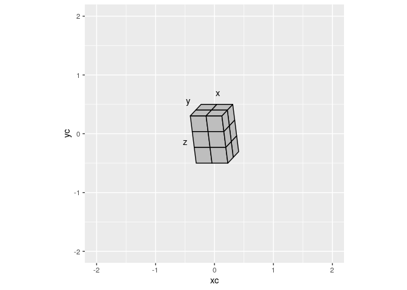
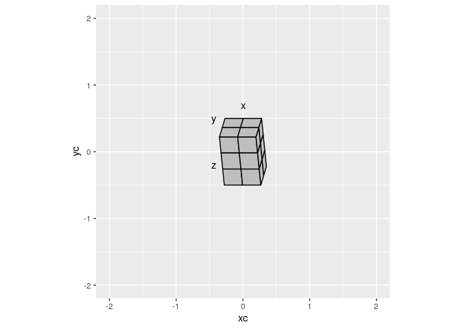
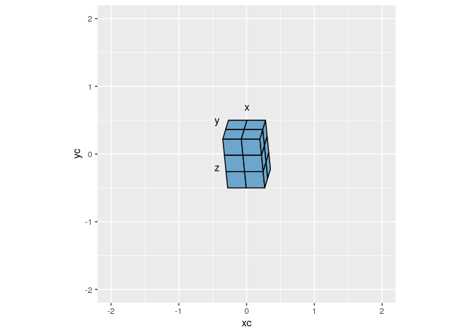
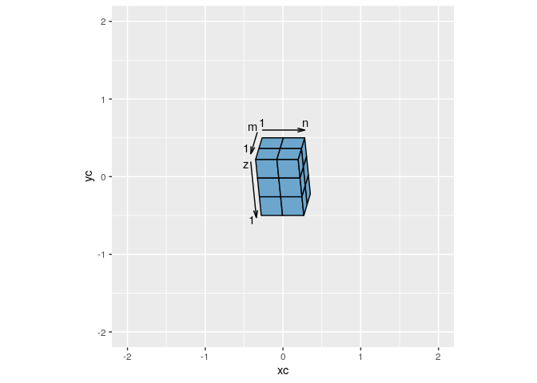
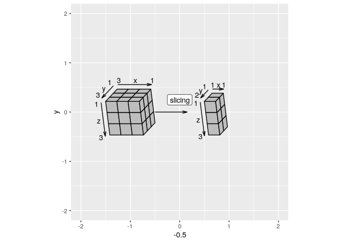
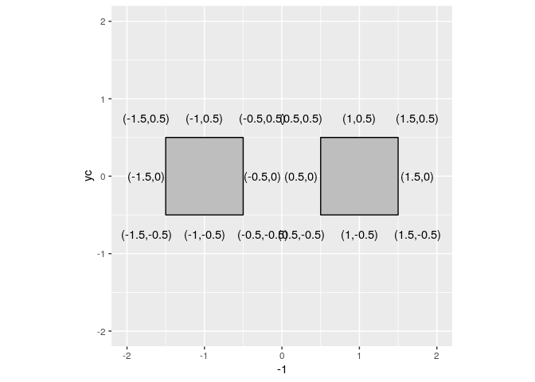
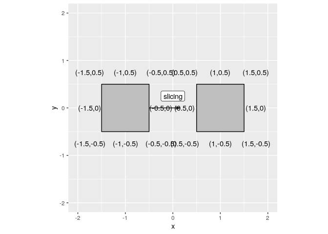
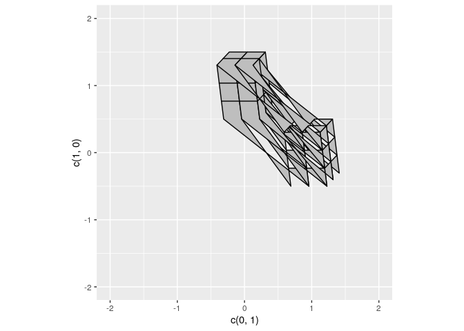

Cookbook
================

## Installation

This package has been submitted to [CRAN](https://CRAN.R-project.org)
and is expected to be available soon using:

``` r
install.packages("ggshapes")
```

For now, the package can be installed using

``` r
devtools::install_github('thmshrt/ggshapes')
```

<!-- ## Showcase -->

<!-- ```{r logo} -->

<!-- ggplot() + -->

<!--   coord_equal() + -->

<!--   scale_x_continuous(limits = c(-2,2)) + -->

<!--   scale_y_continuous(limits = c(-2,2)) + -->

<!--   #  -->

<!--   geom_matrix( -->

<!--     mapping = aes( -->

<!--       xc = c( 1), -->

<!--       yc = c(-1), -->

<!--       lx = c( 2), -->

<!--       ly = c( 2), -->

<!--       lz = c( 1) -->

<!--     ) -->

<!--   ) -->

<!-- ``` -->

## Drawing Matrices

### Single Matrix

By default matrices are rotated - 70 degrees anticlockwise about the “x”
axis - 20 degrees anticlockwise about the “y” axis - 0 degrees
anticlockwise about the “z” axis

This provides a view of the `top`, `right`, `front` faces.

``` r
library(ggplot2)
library(ggshapes)
```

    ## 
    ## Attaching package: 'ggshapes'

    ## The following object is masked from 'package:base':
    ## 
    ##     scale

``` r
ggplot() +
  coord_equal() +
  scale_x_continuous(limits = c(-2,2)) +
  scale_y_continuous(limits = c(-2,2)) +
  geom_matrix(
    mapping = aes(xc = 0, yc = 0, lx = 2, ly = 2, lz = 3)
    ) +
  geom_matrix_labels(
    mapping = aes(xc = 0, yc = 0, lx = 2, ly = 2, lz = 3)
    )
```

<!-- -->

Matrices may however be rotated using `degx`, `degy`, `degz` parameters.
Here we decrease the `degx` and `degy` axis rotation and leave `degz` to
its default `0`.

``` r
library(ggplot2)
library(ggshapes)

ggplot() +
  coord_equal() +
  scale_x_continuous(limits = c(-2,2)) +
  scale_y_continuous(limits = c(-2,2)) +
  geom_matrix(
    mapping = aes(xc = 0, yc = 0, lx = 2, ly = 2, lz = 3), 
    degx = 60, degy = 10, degz = 0
    ) +
  geom_matrix_labels(
    mapping = aes(xc = 0, yc = 0, lx = 2, ly = 2, lz = 3), 
    degx = 60, degy = 10, degz = 0
    )
```

<!-- -->

We can also change the color of the matrix faces in the the normal way
using `fill`. Matrix faces, however, cannot be independently coloured
(just yet)\!

``` r
library(ggplot2)
library(ggshapes)

ggplot() +
  coord_equal() +
  scale_x_continuous(limits = c(-2,2)) +
  scale_y_continuous(limits = c(-2,2)) +
  geom_matrix(
    mapping = aes(xc = 0, yc = 0, lx = 2, ly = 2, lz = 3), 
    degx = 60, degy = 10, degz = 0,
    fill = 'skyblue3'
    ) +
  geom_matrix_labels(
    mapping = aes(xc = 0, yc = 0, lx = 2, ly = 2, lz = 3), 
    degx = 60, degy = 10, degz = 0
    )
```

<!-- -->

Label position can however be changed using `xpos`, `xlabel`, `ypos`,
`ylabel`, `zpos`, `zlabel`. To understand the `pos` parameter, we need
to view the axes with the `arrow` argument filled in. The pos values of
`start`, `middle`, `end`, equate to positions along the arrow. `start`
is the tail of the arrow, `end` in the head of the arrow.

``` r
library(ggplot2)
library(ggshapes)

ggplot() +
  coord_equal() +
  scale_x_continuous(limits = c(-2,2)) +
  scale_y_continuous(limits = c(-2,2)) +
  geom_matrix(
    mapping = aes(xc = 0, yc = 0, lx = 2, ly = 2, lz = 3), 
    degx = 60, degy = 10, degz = 0,
    fill = 'skyblue3'
    ) +
  geom_matrix_axes(
    mapping = aes(xc = 0, yc = 0, lx = 2, ly = 2, lz = 3), 
    degx = 60, degy = 10, degz = 0,
    arrow = arrow(15,unit(.25,'cm'))
    ) +
  geom_matrix_labels(
    mapping = aes(xc = 0, yc = 0, lx = 2, ly = 2, lz = 3), 
    degx = 60, degy = 10, degz = 0,
    xlabel = c('xs','xm','xe'), xpos = c('start','middle','end')
    )
```

<!-- -->

This permits us to construct very nice looking matrices with dimensions
labeled. (There is currently a bug here, which resulted in the reversal
of the `y` and `z` labels). This will be fixed in the next patch\!

``` r
library(ggplot2)
library(ggshapes)

ggplot() +
  coord_equal() +
  scale_x_continuous(limits = c(-2,2)) +
  scale_y_continuous(limits = c(-2,2)) +
  geom_matrix(
    mapping = aes(xc = 0, yc = 0, lx = 2, ly = 2, lz = 3), 
    degx = 60, degy = 10, degz = 0,
    fill = 'skyblue3'
    ) +
  geom_matrix_axes(
    mapping = aes(xc = 0, yc = 0, lx = 2, ly = 2, lz = 3), 
    degx = 60, degy = 10, degz = 0,
    arrow = arrow(15,unit(.25,'cm'))
    ) +
  geom_matrix_labels(
    mapping = aes(xc = 0, yc = 0, lx = 2, ly = 2, lz = 3), 
    degx = 60, degy = 10, degz = 0,
    xlabel = c(1,'n'), xpos = c('start','end'),
    ylabel = c(1,'m'), ypos = c('end','start'),
    zlabel = c(1,'z'), zpos = c('end','start')
    )
```

<!-- -->

## Slicing Matrices

Matrices are not interesting if they cannot be manipulated. Slicing is a
natural next step. To help us better setup matrix locations, we can use
the `geom_viewport`. `geom_viewport` provides a box and positions which
we can use to set up larger figures.

Let’s work backwards. We want to create the following.

``` r
library(ggplot2)
library(ggshapes)
library(grid)

ggplot() +
  coord_equal() +
  scale_x_continuous(limits = c(-2,2)) +
  scale_y_continuous(limits = c(-2,2)) +
  # viewport 
  # geom_viewport(aes(xc = -1, yc = 0, w = 1, h = 1)) +
  geom_matrix(
    mapping = aes(
      xc = -1, yc = 0, 
      lx = 3, ly = 3, lz = 3)) +
  geom_matrix_axes(
    mapping = aes(
      xc = -1, yc = 0, 
      lx = 3, ly = 3, lz = 3),
    arrow = arrow(15,unit(.25,'cm'))
    ) +
  geom_matrix_labels(
    mapping = aes(
      xc = -1, yc = 0, 
      lx = 3, ly = 3, lz = 3),
    xpos = c('start','middle','end'), xlabel = c('3','x','1'),
    ypos = c('start','middle','end'), ylabel = c('3','y','1'),
    zpos = c('start','middle','end'), zlabel = c('3','z','1')
    ) +
  geom_segment(
    mapping = aes(x = -0.5,xend = 0.15, y = 0, yend = 0),
    arrow = arrow(15, unit(.25,'cm'))
  ) +
  geom_label(
    mapping = aes(x = 0, y = .25, label = 'slicing')
  ) +
  # viewport
  # geom_viewport(aes(xc = +1, yc = 0, w = 1, h = 1)) +
  geom_matrix_slice(
    mapping = aes(xc = +1, yc = 0, 
                  lx = 3, ly = 3, lz = 3,
                  ix = 1, ixend = 1, iy = 1, iyend = 2, iz = 1, izend = 3)) +
  geom_matrix_slice_axes(
    mapping = aes(xc = +1, yc = 0, 
                  lx = 3, ly = 3, lz = 3,
                  ix = 1, ixend = 1, iy = 1, iyend = 2, iz = 1, izend = 3),
    arrow = arrow(15,unit(.25,'cm'))) +
 geom_matrix_slice_labels(
    mapping =  aes(xc = +1, yc = 0, 
                  lx = 3, ly = 3, lz = 3,
                  ix = 1, ixend = 1, iy = 1, iyend = 2, iz = 1, izend = 3),
    xpos = c('start','middle','end'), xlabel = c('1','x','1'),
    ypos = c('start','middle','end'), ylabel = c('2','y','1'),
    zpos = c('start','middle','end'), zlabel = c('3','z','1')
    )
```

<!-- -->

We’ll start with `geom_viewports` to find out where we want our matrices
to be.

``` r
library(ggplot2)
library(ggshapes)
library(grid)

ggplot() +
  coord_equal() +
  scale_x_continuous(limits = c(-2,2)) +
  scale_y_continuous(limits = c(-2,2)) +
  # viewport 
  geom_viewport(aes(xc = -1, yc = 0, w = 1, h = 1)) +
  # viewport
  geom_viewport(aes(xc = +1, yc = 0, w = 1, h = 1)) 
```

<!-- -->

The edge points can be used as anchors for placing various segments.

``` r
library(ggplot2)
library(ggshapes)
library(grid)

ggplot() +
  coord_equal() +
  scale_x_continuous(limits = c(-2,2)) +
  scale_y_continuous(limits = c(-2,2)) +
  # viewport 
  geom_viewport(aes(xc = -1, yc = 0, w = 1, h = 1)) +
  geom_label(
    mapping = aes(x = 0, y = .25, label = 'slicing')
  ) +
  geom_segment(
    mapping = aes(x = -0.5,xend = 0.15, y = 0, yend = 0),
    arrow = arrow(15, unit(.25,'cm'))
  ) +
  # viewport
  geom_viewport(aes(xc = +1, yc = 0, w = 1, h = 1)) 
```

<!-- -->

We can now remove the viewports since we know our `w` and `h` parameters
and use these in out `geom_matrix` calls. One current problem is the
syntax. `w` in viewport is `viewx` in `geom`s and `h` in viewport is
`viewy` in `geom`s. I apologize for any confusion this will cause. I am
currently rewriting `ggshapes` for uniform syntax and speed as well as
writing more comprehensive documentation.

``` r
library(ggplot2)
library(ggshapes)
library(grid)

ggplot() +
  coord_equal() +
  scale_x_continuous(limits = c(-2,2)) +
  scale_y_continuous(limits = c(-2,2)) +
  # viewport 
  geom_matrix(
    mapping = aes(
      xc = -1, yc = 0, 
      lx = 3, ly = 3, lz = 3)) +
  geom_matrix_axes(
    mapping = aes(
      xc = -1, yc = 0, 
      lx = 3, ly = 3, lz = 3),
    arrow = arrow(15,unit(.25,'cm'))
    ) +
  geom_matrix_labels(
    mapping = aes(
      xc = -1, yc = 0, 
      lx = 3, ly = 3, lz = 3),
    xpos = c('start','middle','end'), xlabel = c('3','x','1'),
    ypos = c('start','middle','end'), ylabel = c('3','y','1'),
    zpos = c('start','middle','end'), zlabel = c('3','z','1')
    ) +
  geom_segment(
    mapping = aes(x = -0.5,xend = 0.15, y = 0, yend = 0),
    arrow = arrow(15, unit(.25,'cm'))
  ) +
  geom_label(
    mapping = aes(x = 0, y = .25, label = 'slicing')
  ) +
  # viewport
  geom_matrix_slice(
    mapping = aes(xc = +1, yc = 0, 
                  lx = 3, ly = 3, lz = 3,
                  ix = 1, ixend = 1, iy = 1, iyend = 2, iz = 1, izend = 3)) +
  geom_matrix_slice_axes(
    mapping = aes(xc = +1, yc = 0, 
                  lx = 3, ly = 3, lz = 3,
                  ix = 1, ixend = 1, iy = 1, iyend = 2, iz = 1, izend = 3),
    arrow = arrow(15,unit(.25,'cm'))) +
 geom_matrix_slice_labels(
    mapping =  aes(xc = +1, yc = 0, 
                  lx = 3, ly = 3, lz = 3,
                  ix = 1, ixend = 1, iy = 1, iyend = 2, iz = 1, izend = 3),
    xpos = c('start','middle','end'), xlabel = c('1','x','1'),
    ypos = c('start','middle','end'), ylabel = c('2','y','1'),
    zpos = c('start','middle','end'), zlabel = c('3','z','1')
    )
```

<!-- -->

## Known Bugs

  - **multiple matrices cannot be drawn at once**

<!-- end list -->

``` r
ggplot() +
  coord_equal() +
  scale_x_continuous(limits = c(-2,2)) +
  scale_y_continuous(limits = c(-2,2)) +
  geom_matrix(mapping = aes(xc = c(0,1), yc = c(1,0), lx = 2, ly = 2, lz = 3))
```

<!-- -->

  - **matrix slices do not follow common index convention**

<!-- end list -->

``` r
ggplot() +
  coord_equal() +
  scale_x_continuous(limits = c(-2,2)) +
  scale_y_continuous(limits = c(-2,2)) +
  # viewport 
  # geom_viewport(aes(xc = -1, yc = 0, w = 1, h = 1)) +
  geom_matrix(
    mapping = aes(
      xc = -1, yc = 0, 
      lx = 3, ly = 3, lz = 3)) +
  geom_matrix_axes(
    mapping = aes(
      xc = -1, yc = 0, 
      lx = 3, ly = 3, lz = 3),
    arrow = arrow(15,unit(.25,'cm'))
    ) +
  geom_matrix_labels(
    mapping = aes(
      xc = -1, yc = 0, 
      lx = 3, ly = 3, lz = 3),
    xpos = c('start','middle','end'), xlabel = c('3','x','1'),
    ypos = c('start','middle','end'), ylabel = c('3','y','1'),
    zpos = c('start','middle','end'), zlabel = c('3','z','1')
    ) +
  geom_segment(
    mapping = aes(x = -0.5,xend = 0.15, y = 0, yend = 0),
    arrow = arrow(15, unit(.25,'cm'))
  ) +
  geom_label(
    mapping = aes(x = 0, y = .25, label = 'slicing')
  ) +
  # viewport
  # geom_viewport(aes(xc = +1, yc = 0, w = 1, h = 1)) +
  geom_matrix_slice(
    mapping = aes(xc = +1, yc = 0, 
                  lx = 3, ly = 3, lz = 3,
                  ix = 1, ixend = 1, iy = 1, iyend = 2, iz = 1, izend = 3)) +
  geom_matrix_slice_axes(
    mapping = aes(xc = +1, yc = 0, 
                  lx = 3, ly = 3, lz = 3,
                  ix = 1, ixend = 1, iy = 1, iyend = 2, iz = 1, izend = 3),
    arrow = arrow(15,unit(.25,'cm'))) +
 geom_matrix_slice_labels(
    mapping =  aes(xc = +1, yc = 0, 
                  lx = 3, ly = 3, lz = 3,
                  ix = 1, ixend = 1, iy = 1, iyend = 2, iz = 1, izend = 3),
    xpos = c('start','middle','end'), xlabel = c('1','x','1'),
    ypos = c('start','middle','end'), ylabel = c('2','y','1'),
    zpos = c('start','middle','end'), zlabel = c('3','z','1')
    )
```

<!-- -->
